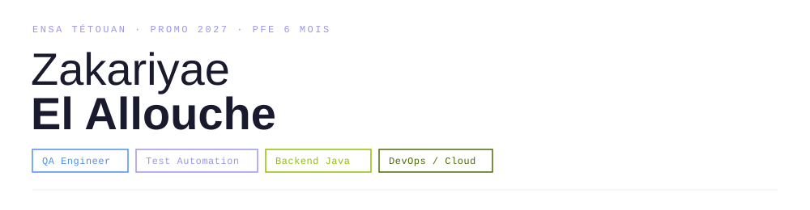

  

Je conçois et automatise des stratégies de test pour des applications backend et des systèmes d'IA — de la conception de scénarios end-to-end à la validation d'APIs et de comportements sensibles.

 

### `COMPÉTENCES`

| | |
|---|---|
| **QA & Test** | Selenium · TestNG · RestAssured · Postman |
| **Backend** | Java · Spring Boot · REST APIs · Kafka |
| **DevOps & Cloud** | Docker · Kubernetes · GitHub Actions · AWS · OCI |
| **Gen AI** | RAG · LangChain · Prompt Engineering · Vector Search |
| **Data** | PostgreSQL · MySQL · Oracle SQL |

 

### `PROJETS SÉLECTIONNÉS`

<table>
<tr>
<td width="100%">

**[Spawnta](https://github.com/ism4il-04/spawnta.git)** — Plateforme sociale d'activités
Scénarios de test end-to-end sur les parcours critiques, automatisation UI/API, pipeline CI/CD déployé sur AWS.
`Spring Boot` `Angular` `PostgreSQL` `AWS` `Selenium` `RestAssured`

</td>
</tr>
<tr>
<td width="100%">

**[SGITU](https://github.com/AmineElBiyadi/SGITU-Microservices.git)** — Gestion de transport urbain
Microservice Users dans une architecture distribuée, event streaming asynchrone, déploiement Kubernetes local.
`Spring Boot` `Kafka` `Docker` `Kubernetes` `Spring Security`

</td>
</tr>
<tr>
<td width="100%">

**[Assistant IA multilingue](https://github.com/zakariyaee/emc-helpline-chatbot.git)** — Support cyberviolence · `61 tests`
Pipeline RAG multilingue avec filtrage de sécurité et détection de crise.
`Python` `RAG` `ChromaDB` `FastAPI` `Streamlit`

</td>
</tr>
</table>

 

### `CERTIFICATIONS`

- ☁️ **Oracle Cloud Infrastructure Foundations Associate** — Oracle · 2025
- 🧪 **ISTQB Certified Tester Foundation Level** — En cours

 

### `GITHUB STATS`

 

  

DISPONIBLE · PFE 6 MOIS 
<b>QA Engineering · Test Automation · Backend Java · DevOps / Cloud</b>

